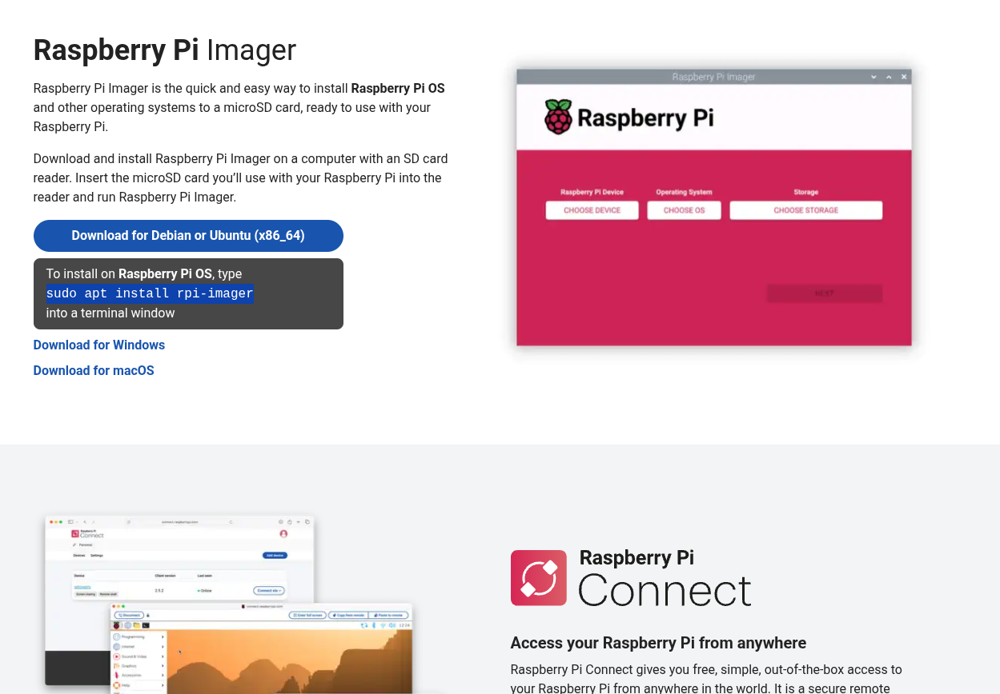
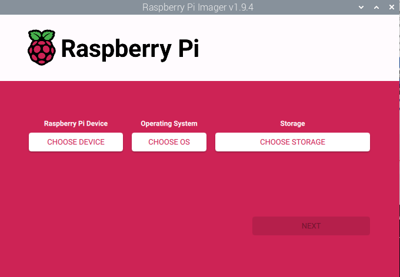

# Setting up your Pi

Congrats on getting a Pi!

## Get some storage

The Pi has build in memory (RAM) but no storage. To start using your Pi you will need some kind storage where your operating system (and other files) will reside.

- If you are a beginner and just want to boot up your Pi, the easiest thing to do is to get an SD card. 
- If you know you will use your Pi for heavier tasks, like as a server, streaming movies, or as NAS, I recommend to get an SSD.

## Raspberry Pi imager

If you have your choosen storage, you will need to flash the operating system on it. For that you will need another working computer. It can another Linux or a Windows or a Mac.

You will need to download a software called `Raspberry Pi imager` that writes the operating system onto your storage.

Go to [the official Pi website](https://www.raspberrypi.com/software/) and follow the instructions there to download the imager.

Connect your storage to your computer and start the imager

