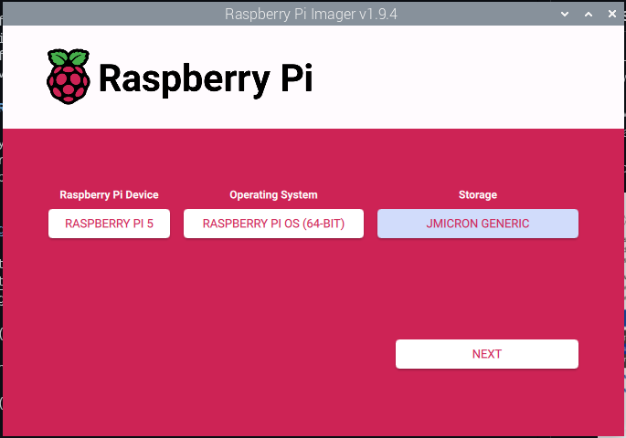
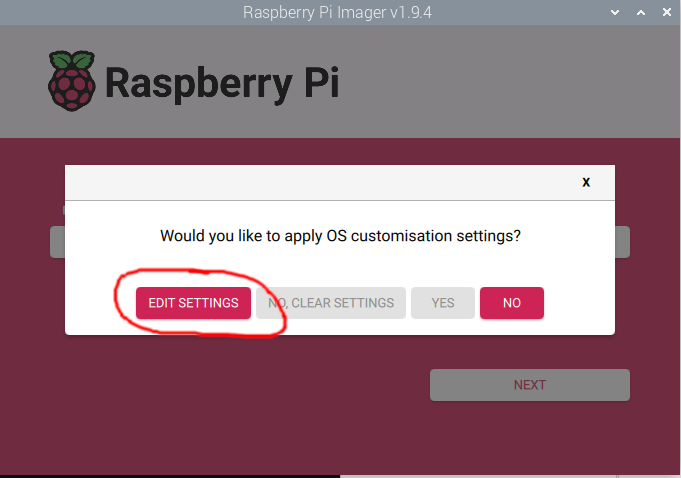

# Setting up your Pi

last update: october 2025

Congrats on getting a Pi!

## Get some storage

The Pi has build in memory (RAM) but no storage. To start using your Pi you will need some kind of storage where your operating system (and other files) will reside.

- If you are a beginner and just want to boot up your Pi, the easiest thing to do is to get a micro SD card. 
- If you know you will use your Pi for heavier tasks, like as a server, streaming movies, or as NAS, I recommend to get an SSD.

## Raspberry Pi imager

If you have your choosen storage, you will need to flash the operating system on it. For that you will need another working computer. It can be another Linux or a Windows or a Mac.

You will need to download a software called `Raspberry Pi imager` that writes the operating system onto your storage.

Go to [the official Pi website](https://www.raspberrypi.com/software/) and follow the instructions there to download the imager.

Connect your storage to your computer and start the imager

Choose the kind of device you have.

If you want to use your Pi as a desktop, browse the web, watch movies etc, then choose the full-fledged 64bit operating system. It has a desktop GUI.

If you only want to access your Pi remotely, you can choose the lite version of the Pi OS, that has no desktop GUI. You can only manage it from the terminal. 

Under `Storage` choose the SD card or SSD you want to install the OS on.

Click `Next`

When prompted, click on `Edit settings`

Now we will set some basic settings, so your Pi is immediately ready to use on first startup. You can skip these settings if you want to, you can always change them later.

