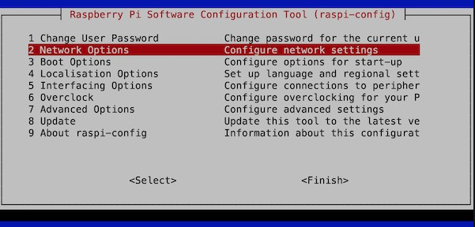

# Accessing the Raspberry Pi's camera

- First you will need a camera module. There is no built-in camera on the Raspberry Pi. You will have to buy one separately.
- Connect the camera module to the Pi. You can find pictures online on how to do this. I will upload some here if I will have.
- Start the Pi and in the terminal run this command: 

`sudo raspi-config`

- This brings up a BIOS setting like window:

- Go to `Interfacing options`.
- Choose the `Enable camera` option and hit `Enter`.
- To test if it works you can use OpenCV or any other program you like.