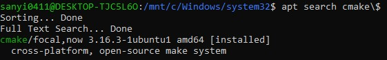
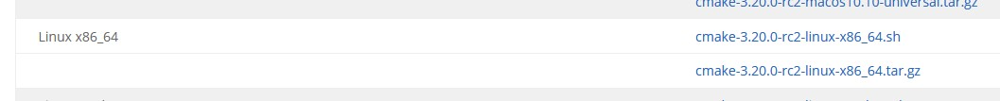

# Comprehensive CMake Tutorial

## What is CMake

## Prerequisities
//TODO: have gcc or clang installed

## How to install

### Linux

For this tutorial I am using Ubuntu 20.04 LTS

There are 2 ways to install CMake on Ubuntu but the easier and faster way may not get you the latest release of CMake, so I advise you to choose the second option below

1. Install from command line
    - Open a command line and run `apt search cmake\$` to see the available version
    - At the time of writing the latest release you can get this way is 3.16.3
    - Run `sudo apt-get install cmake` to download and install CMake
    - Verify the installation by running `cmake --version`



2. Install from shell script
    - Open a browser and go to `cmake.org/download/`
    - Find the Linux version and download the belonging shell script (file name ends with **.sh**)
    - At the timw of writing the latest version on the website is 3.20.0
        - Now you can see why it is better to download CMake from the website
    - Run the shell script by `sudo sh cmake.sh --prefix=/usr/local`
        - You can use prefix argument to specify the install location
    - Verify the installation by running `cmake --version`



### Windows

## Hello World
    - Create a new folder for a new project. This is going to be the root folder of your project.
    - It is good practice to keep your source and build files separate so create a **build** and a **src** folder in the root folder
    - In the **src** folder create a **main.cpp** and write a simple Hello World application
    - Create a `CMakeLists.txt` in the root folder and add the following:

```
cmake_minimum_required(VERSION 3.16)
project(MyProject VERSION 1.0.0)

add_executable(Hello src/main.cpp)
```

    - The first line specifies the minimum version required to build your app with CMake. If someone tries to build your app with a lower version, it will fail
    - The second line sets the name of the project and stores it in a variable PROJECT_NAME. The VERSION is optional.
    - On the third line the first argument is what the name of the executable will be (in this case Hello.exe on Windows) and the following arguments are the source files used for the build

1. Build using cmake
    - *cmake* is a command line interface

2. Build using ccmake
    - *ccmake* is a terminal based gui. It is somewhere between a command line interface and a nice, windowed GUI, like cmake GUI