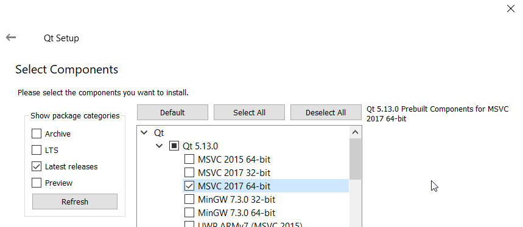
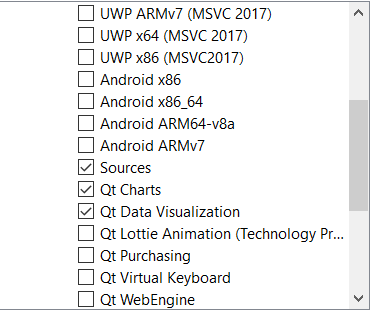
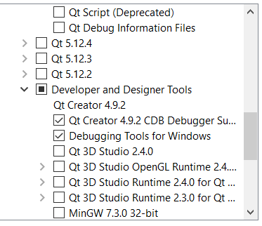
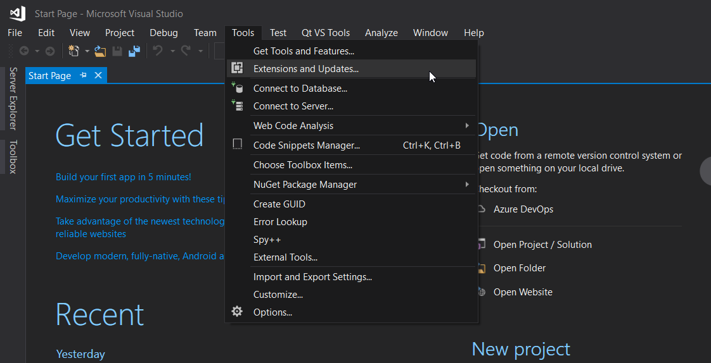
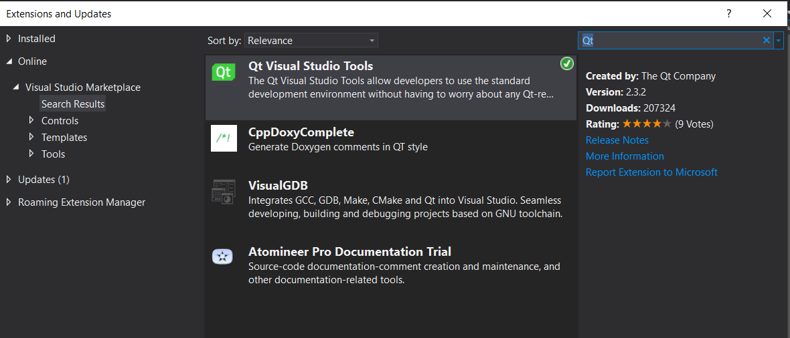
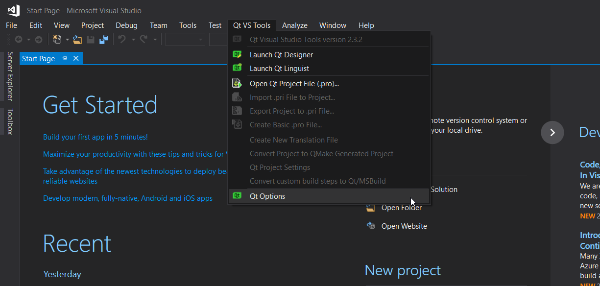
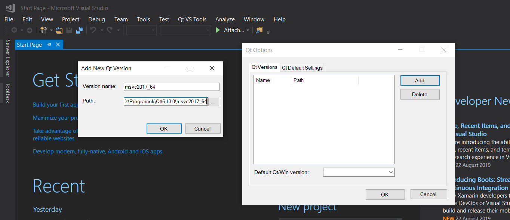
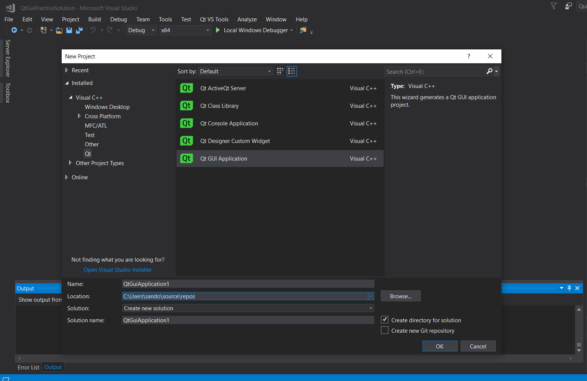

# How to install Qt on Visual Studio

- For this tutorial I am using Visual Studio 2017, on Windows 10 64bit. 
- I assume you already have Visual Studio downloaded and installed.

### Download Qt

- Go to [Qt's](https://www.qt.io/) website, go to the [Download](https://www.qt.io/download) section, and download the open source version. Check if the site detected your system correctly.

### Run the installer

**Note:** You will only be able to install Qt in an empty folder, so not even the installer can be in there.

- When selecting the components, under `Qt<version number>` select `MSVC 2017 64-bit`:

- If you have a different system select the one according to your system.
- Still in this section scroll down a little bit and select `Sources`, `Qt Charts` and `Qt Visualization`

- In the `Developer and Designer Tools` section select these ones:

- From here on just click `next`

### Visual Studio extension

- Open Visual Studio
- Click `Tools -> Extensions and Updates`

- Search for `Qt`
- Install `Qt Visual Studio Tools`

- After installation you should see a `Qt VS Tools` menu option
- Click on that, then click `Qt Options`

- Under `Qt Versions` click `Add`, then click on the 3 dots next to `Path`
- You have to browse the following folder: `<folder where you installed Qt>/<version number>/<system type>`
- I have downloaded version 5.13.0 for Visual Studio 2017 64-bit and I have installed it in `D:\Programs\Qt` so my path will be: `D:\Programs\Qt\5.13.0\msvc2017_64`

- After browsing in the correct folder the `Version name` should be filled out automatically
- After this you can create a new Qt project

