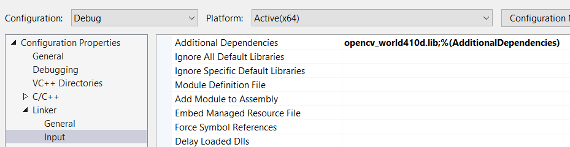

# How to install OpenCV with Visual Studio

For this tutorial I am using Visual Studio 2017 Community edition on Windows 10.<br/>
Currently the newest version of OpenCV is 4.1.1 but it also works with 4.1.0.</br>
<br/>
I assume you already have Visual Studio 2017 downloaded and installed.<br/>

### 1. Download OpenCV

- Go to the [OpenCV website](https://opencv.org/releases/), under `Releases` find `OpenCV - 4.1.1` and click the `Windows` buttons.<br/>

- Download the .exe file and put in a separate folder(the .exe should be around 220 MB).<br/>
- I have put it in my `D:/Programs/OpenCV` folder, so I will refer to this later on.<br/>
- Run the .exe and choose the same folder to extract to.<br/>

### 2. Setting up the enviromental variables

- On Windows 10 click the Start button on bottom left (or alternatively press the Windows key).<br/>
- Start typing `environment` then click the `Edit the system environment variables`.<br/>
- On the `Advanced` page click `Environment Variables..`. <br/>
- Create a `New...` System variable, the name should be `OPENCV_DIR`, the value is [the new folder that was created after running the .exe file]\build\x64\vc15<br/>


- In my case it's `D:\Programs\OpenCV\opencv\build\x64\vc15`<br/>
- Click on the existing variable called 'Path', click 'Edit' and add a new line with the following:<br/>
%OPENCV_DIR%\bin <br/>


### 3. Setting up your project

- After creating a new Solution/Project in Visual Studio, right click on the project (in the Solution explorer) and click properties.<br/>
- Set Configuration (top right corner) to All Configurations
- Go to C++/General. To '`Additional Include Directories` add `$(OPENCV_DIR)\..\..\include`


- Go to C++/Precompiled Headers. Set the Precompiled Header to `Not Using Precompiled Headers`


- Go to Linker/General. To `Additional Library Directories` add `$(OPENCV_DIR)\lib`


- Set Configuration to Release
- Go to Linker/Input. To `Additional Dependencies` add `opencv_world411.lib` (or `opencv_world411.lib` if you downloaded OpenCV 4.1.0)


- Set Configuration to Debug
- To `Additional Dependencies` add `opencv_world411d.lib` (or `opencv_world411d.lib` if you downloaded OpenCV 4.1.0)




### 4. Run a test to see everything works the way it should be

- Copy this code to main:
```C++
#include <iostream>
#include "opencv2/core.hpp"
#include "opencv2/highgui.hpp"
#include "opencv2/imgproc.hpp"

int main()
{
	cv::Mat test(cv::Size(200, 200), CV_8UC3, cv::Scalar(255, 0, 0));
	cv::imshow("Test", test);
	cv::waitKey(0);
}
```
- If a blue window pups up all should be fine
