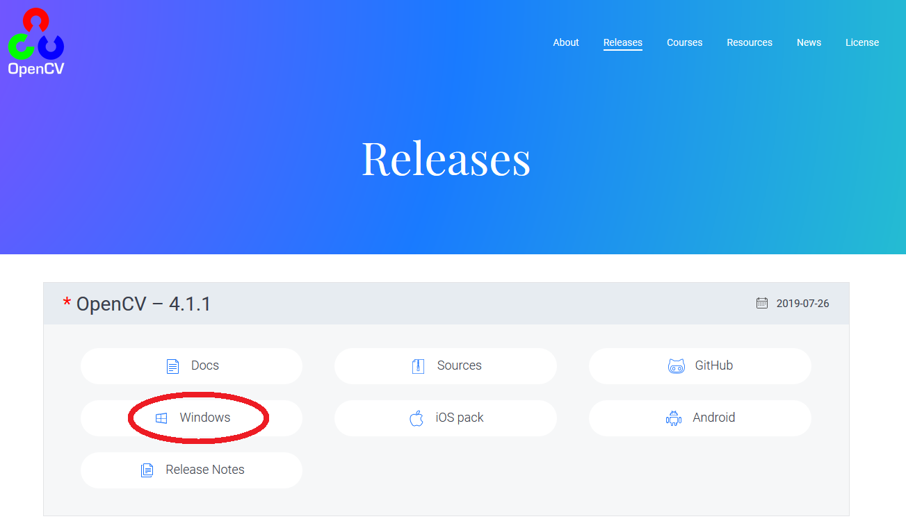

# How to install OpenCV with Visual Studio

**Note**:
- If you want to see basic tutorials on how to use OpenCV, check out my other repo: [OpenCV](https://github.com/green-fox-academy/sanyi0411/tree/master/OpenCV)
- If you want to use `Text recognition` in your application, you will find instructions on how to add `tesseract` to your project at the end of this tuorial

For this tutorial I am using Visual Studio 2017 Community edition on Windows 10 64bit.<br/>
Currently the newest version of OpenCV is 4.1.1 but it also works with 4.1.0.</br>
<br/>
I assume you already have Visual Studio 2017 downloaded and installed.<br/>

### 1. Download OpenCV

- Go to the [OpenCV website](https://opencv.org/releases/), under `Releases` find `OpenCV - 4.1.1` and click the `Windows` button.<br/>

- Download the .exe file and put in a separate folder(the .exe should be around 220 MB).<br/>
- I have put it in my `D:/Programs/OpenCV` folder, so I will refer to this later on.<br/>
- Run the .exe and choose the same folder to extract to.<br/>

### 2. Setting up the enviroment variables

- On Windows 10 click the Start button on bottom left (or alternatively press the Windows key).<br/>
- Start typing `environment` then click the `Edit the system environment variables`.<br/>
- On the `Advanced` page click `Environment Variables...`. <br/>
- Create a `New...` System variable, the name should be `OPENCV_DIR`, the value is [the new folder that was created after running the .exe file]\build\x64\vc15<br/>


- In my case it's `D:\Programs\OpenCV\opencv\build\x64\vc15`<br/>
- Click on the existing variable called `Path`, click `Edit` and add a new line with the following:<br/>
`%OPENCV_DIR%\bin` <br/>


- **Note** that you have to restart your computer at this point. New environment variables will only come into effect after a restart.

### 3. Setting up your project

- After creating a new Solution/Project in Visual Studio, right click on the project (in the Solution explorer) and click properties.<br/>
- Set Configuration (top left corner) to All Configurations
- Go to C++/General. To '`Additional Include Directories` add `$(OPENCV_DIR)\..\..\include`


- Go to C++/Precompiled Headers. Set the Precompiled Header to `Not Using Precompiled Headers`


- Go to Linker/General. To `Additional Library Directories` add `$(OPENCV_DIR)\lib`


- Set Configuration to Release
- Go to Linker/Input. To `Additional Dependencies` add `opencv_world411.lib` (or `opencv_world410.lib` if you downloaded OpenCV 4.1.0)


- Set Configuration to Debug
- To `Additional Dependencies` add `opencv_world411d.lib` (or `opencv_world410d.lib` if you downloaded OpenCV 4.1.0)


### 4. Run a test to see everything works the way it should

- Copy this code to main:
```C++
#include <iostream>
#include "opencv2/core.hpp"
#include "opencv2/highgui.hpp"
#include "opencv2/imgproc.hpp"

int main()
{
	cv::Mat test(cv::Size(200, 200), CV_8UC3, cv::Scalar(255, 0, 0));
	cv::imshow("Test", test);
	cv::waitKey(0);
}
```
- If a blue window pups up all should be fine

### +1: Tesseract

- With [Tesseract](https://en.wikipedia.org/wiki/Tesseract_(software)) you can recognise characters and "read text"
- To install tesseract, first you will need a package manager called `vcpkg`
- Go to [Microsoft's vcpkg repo](https://github.com/microsoft/vcpkg) and follow the instructions there: you will have clone the repo on your computer but then you only need the `To get started` and `user-wide integration` sections
- In your Command Window navigate to the cloned `vcpkg` folder and run the following code: `vcpkg install tesseract:x64-windows`
- For more info on installing tesseract check out their official [Repo](https://github.com/tesseract-ocr/tesseract/wiki/Compiling#windows)
- Tesseract uses pre-trained models to recognise characters. Since there are different characters in different languages, there are different models for (almost) each language. I will show you how to add a model trained for english language. From then on you can add different models if you want to.
- In your `vcpkg` folder, deep inside, there is a folder called `tessdata`. I have cloned the `vcpkg` repo to my `D:\Programs` folder so for me the path to `tessdata` is the following: `D:\Programs\vcpkg\buildtrees\tesseract\src\4.1.0-adb63d30fa\tessdata`
- Find the `tessdata` folder according to this


- Download the pre-trained model from [here](https://github.com/tesseract-ocr/tessdata/blob/master/eng.traineddata)
- Save this `eng.traineddata` file to your `tessddata` folder
- Right now tesseract doesn't know that it should look for this file here
- We need to add a new `Environment variable`, as we did earlier in this tutorial
- The name should be `TESSDATA_PREFIX` and the value is the path to this `tessdata` folder
- **Note** that you will have to restart your computer for the new Environment variable to come into effect

