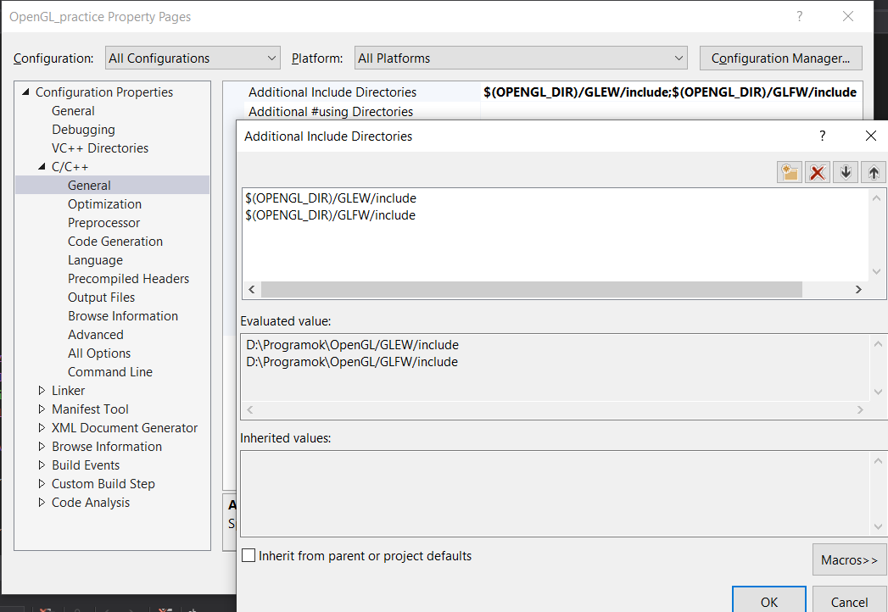

# How to install OpenGL with Visual Studio

For this tutorial I am using Visual Studio 2017 on Windows 10 64bit<br/>
I assume you already have Visual Studio downloaded and installed

### Downloads

- Go to [glew.sourceforge.net](http://glew.sourceforge.net/), in the 'Downloads' section click the latest release


- This will take you to another site from where you should download the '...win32.zip' version

- Go to [glfw.org](https://www.glfw.org/), click 'Download' on the top right and under the 'Windows pre-compiled binaries' download the 64bit version


- I have set up my file system the following:
- 'D:/Programs/OpenGL/GLEW/' -> In here are the files/folders that I have downloaded from the first link, so like 'bin', 'doc', 'include' etc.
- 'D:/Programs/OpenGL/GLFW/' -> In here are the files/folders that I have downloaded from the second link, so like 'docs', 'include', 'lib-vc2017' etc.


### Environment variables

- Hit your 'Windows key' and start typing 'environment', click the 'Edit the system environment variables'
- In the 'Advanced' section click 'Environment variables...2' at the bottom
- Under 'System variables' add a 'New' variable: the name should be 'OPENGL_DIR' and the value is the path to your OpenGL folder, so in my case: 'D:/Programs/OpenGL'


### Setting up your project

- After creating a new C++ project in Visual Studio, right click on the project in the 'Solution explorer', then click 'Properties'
- In the top row set 'Configuration' to 'All configurations' and 'Platform' to 'All platforms'
- Go to C/C++, then General and in the 'Additional Include Directories' set the following:


- Set the 'Platform' to 'x64'
- Go to Linker, then General and in the 'Additional Library Directories' set the following:



- Go to Linker, then Input and add the following 'Additional Dependencies':


- There is one more .dll file that the system will need but will not find it this way so we need to copy it:
- Go to your 'GLEW' folder, then 'bin' -> 'Release' -> 'x64' and in there should be a 'glew32.dll'
- Copy this file in your project folder, next to your .cpp, .vcxproj and .filters files

### Run a test

- To check if your set up is correct run the following code
- You should get a red window

```C++
#include <iostream>
#include <GL/glew.h>
#include <GLFW/glfw3.h>

//Window dimension
const GLint WIDTH = 800, HEIGHT = 600;

int main()
{
    //Initialize GLFW
    if (!glfwInit())
    {
        std::cout << "GLFW Initialization failed" << std::endl;
        glfwTerminate();
        return 1;
    }

    // Setup GLFW window properties
    // OpenGL version
    glfwWindowHint(GLFW_CONTEXT_VERSION_MAJOR, 3);
    glfwWindowHint(GLFW_CONTEXT_VERSION_MINOR, 3);
    // Core profile = No backwards compatibility
    glfwWindowHint(GLFW_OPENGL_PROFILE, GLFW_OPENGL_CORE_PROFILE);
    // Allow forward compatibility
    glfwWindowHint(GLFW_OPENGL_FORWARD_COMPAT, GL_TRUE);

    GLFWwindow *mainWindow = glfwCreateWindow(WIDTH, HEIGHT, "Test Window", NULL, NULL);
    if (!mainWindow)
    {
        std::cout << "GLFW Window creation failed" << std::endl;
        glfwTerminate();
        return 1;
    }

    // Get buffer size infaormation
    int bufferWidth, bufferHeight;
    glfwGetFramebufferSize(mainWindow, &bufferWidth, &bufferHeight);

    // Set context for GLEW to use
    glfwMakeContextCurrent(mainWindow);

    // Allow modern extension features
    glewExperimental = GL_TRUE;

    if (glewInit() != GLEW_OK)
    {
        std::cout << "GLEW initialization failed" << std::endl;
        glfwDestroyWindow(mainWindow);
        glfwTerminate();
        return 1;
    }

    // Setup viewport size
    glViewport(0, 0, bufferWidth, bufferHeight);

    // Loop until window closed
    while (!glfwWindowShouldClose(mainWindow))
    {
        // Get + Handle user input events
        glfwPollEvents();

        // Clear Window
        glClearColor(0.0f, 1.0f, 0.0f, 1.0f);
        glClear(GL_COLOR_BUFFER_BIT);

        glfwSwapBuffers(mainWindow);
    }

    return 0;
}
```