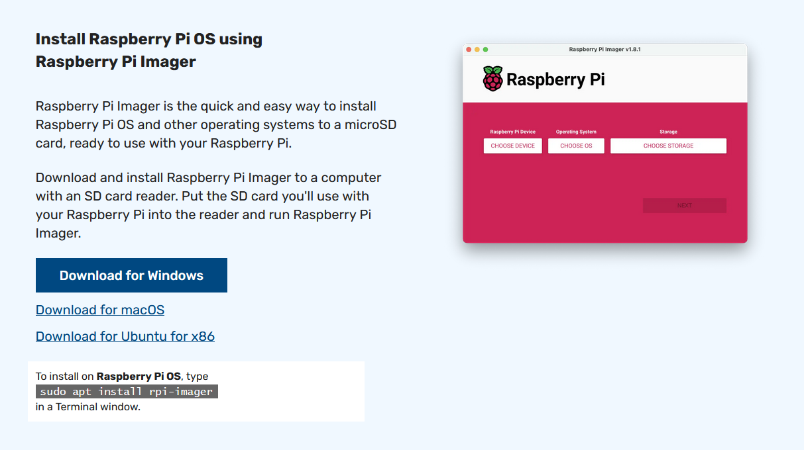
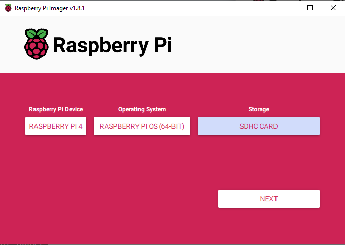
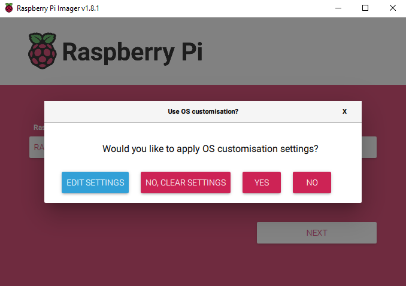
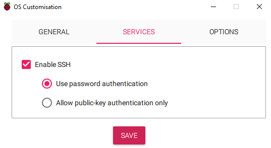

# Raspberry Pi first setup
Last update: november 2023

- Grab a minimum 8GB micro SD card that has no valuable data on it. This will be the Pi's boot drive.
- Go to https://www.raspberrypi.com/software/
- Download the imager for your OS and run it.

- Choose your Pi version, the OS you want to install and the SD card.
    - It is always recommended to choose a 64 bit version of the Pi OS.
    - If you want to use the Pi with a desktop choose the full version.
    - If you want to use the Pi only via a terminal you can choose the lite version, which is less resource intensive but the full version will also work.

- Click `Next`.
- When asked about OS Customization, click `Edit settings`.

- On the `General` tab
    - You can edit the hostname. This is how the Pi will appear on the network.
    - You can set your username and password. It is recommended to set a strong password.
    - You can configure a wlan access so the Pi will automatically connect to Wifi when booted.
    - You can set the timezone and keyboard layout you want to use.

- On the `Services` tab
    - You can enable SSH. If you want to connect to the Pi from another computer enable it.

- Click `Save` and flash the SD card.
- After completition insert the SD card in the Pi.
- If you choose a dektop vesion of the OS you are ready to use it.
- If you want to connect to the Pi from a terminal [follow this tutorial](https://github.com/sanyi0411/Tutorials/tree/master/Raspberry%20Pi/Connect%20to%20Pi%20via%20SSH).