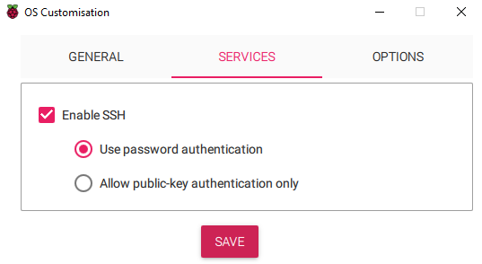
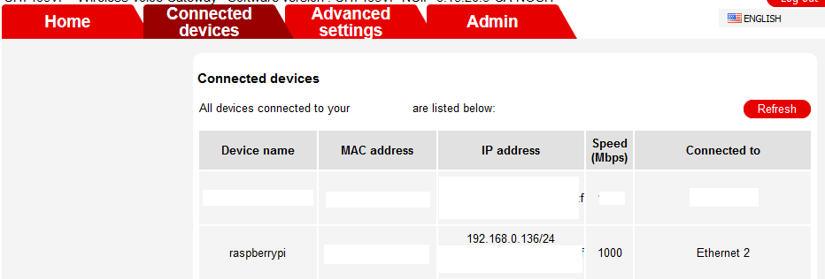
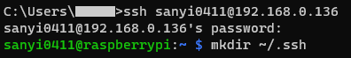
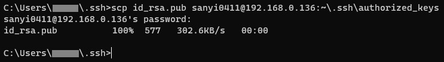

# Connect to Raspberry Pi via SSH
Last update: november 2023

### <u>Enabling SSH on the Pi</u>
<u>Option A</u>
- You can enable SSH in the Raspberry Pi imager, before flashing the OS on the SD card. Check out [this tutorial]().



<u>Option B</u>
- On another computer, insert the SD card and create an empty file named `ssh` (no extension!) in the `/boot` folder.

<u>Option C</u>
- If you have a GUI/desktop version of the Pi OS
    - Open the Start menu (click the raspberry logo in the corner of the desktop)
    - Go to `Preferences` -> `Raspberry Pi Configuration`
    - Open the `Interfaces` tab
    - Next to `SSH` click `Enabled`

### <u>Find the IP address of the Pi</u>
<u>Option A</u>
- Open your router's settings
    - The router's IP is usually something like 192.168.0.1 or 192.168.1.1
- All router GUIs are different. Look for someting like `Connected devices` and take note of your Pi's IP address



<u>Option B</u>
- If you can open a terminal on the Pi, type
```
hostname -I
```

- It will return all the IP addresses of the Pi. You need to choose depending on whether you are using Ethernet or Wifi on the Pi

### <u>Connect via SSH</u>
- Open a terminal on your PC and type
```
ssh username@raspberrypi
```
- Substitute `username` with your username.
- Substitute `raspberrypi` with the hostname that you set (the one that is visible under `Connected devices` in your router's settings) or with the IP address of the Pi
- You will be asked to type in your password to connect. When you type your password no characters, not even *, will appear on the terminal

### <u>Setup passwordless login with SSH keys</u>

- Windows
    - Check if you already have a public key and create one if needed.
        - Go to `C:\Users\<your username>` and check if you have an `.shh` folder and within that an `id_rsa.pub` file
        - If not, open a terminal and type `ssh-keygen`. When asked for filename and passphrase, leave those empty, just hit Enter. Now you have an `id_rsa.pub` file
    - Open a new terminal window and connect to the Pi via SSH
    - On the Pi run `mkdir ~/.ssh`
    - Open a new terminal, navigate to the `.ssh` folder and run `scp id_rsa.pub username@raspberrypi:~\.ssh\authorized_keys`
    - From now on no password is required to ssh into the Pi from this Windows machine/user.





- Mac
    - // TODO