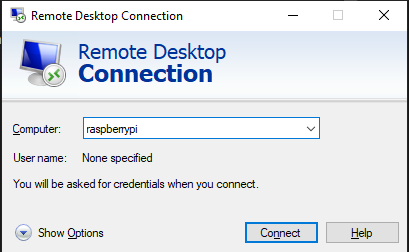

# Connect to Raspberry Pi via Microsoft Remote Desktop

Last update: december 2023

- ssh into your Raspberry Pi or 
- open a new terminal on the Pi if you have access to its desktop
- Run `sudo apt-get update && sudo apt-get upgrade`
- Run `sudo apt-get install xrdp`
- Run `hostname` to get the name of the Pi
- On your Windows machine open `Remote desktop` and connect to `raspberrypi` (or whatever the hostname is)

