# 1. Format SD card
## 1.a If you have an SD card with only one partition
- If you only used your card for photos, videos etc. it most likely only has one partition
- Insert the card in you card reader
- In the file explorer, right click on it
- Click *Format*
- Make sure you under *Capacity* you see the full the capacity of your card (**Note:** A 32GB card will always show up as 29-30GB) and that under *File System* FAT or FAT32 is choosen
- You can put a tick in *Quick format*
- Click Format

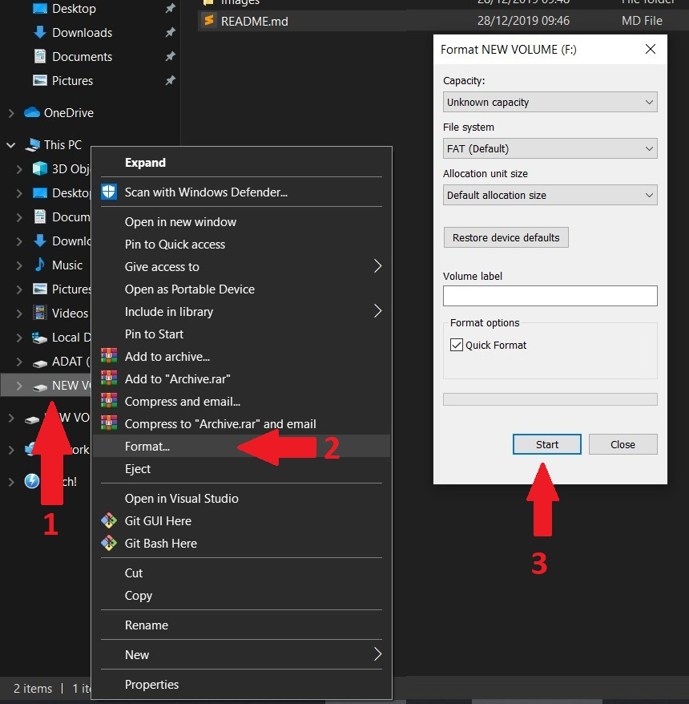

## 1.b If you have an SD card with multiple partitions
- If your card was previuosly used for another Raspberry (or any OS was flashed on it) or you just want to make a fresh install on your existing Pi, the card probably has multiple partitions, like *boot* and *recovery*
- Insert the card in you card reader
- Open up a command line: press the windows key, type *cmd* and press enter. A black command line window should open
- Type *Diskpart*, press enter. This may open up a new window
- Type *list disk*. You should see your hard drive(s) and the SD card listed
- Type *select disk n*, where n is the number of the SD card in the list. You should get a *Disk n is now the selected disk* message.
- Type *clean*. This will delete all the partitions and you'll have one big unallocated space

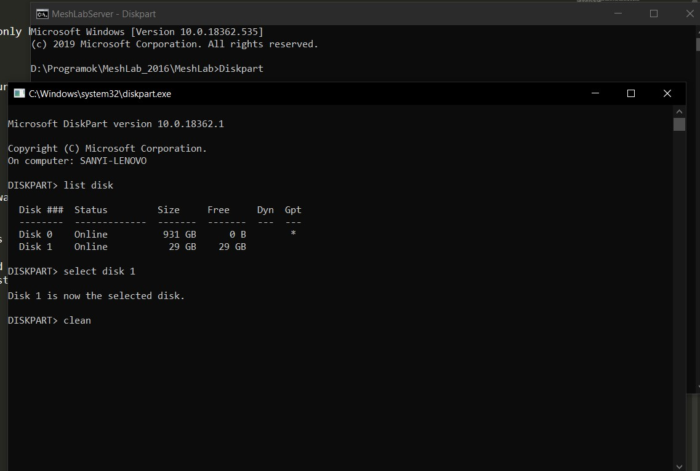

- To allocate this space: right click on the Windows home button, than click *Disk Management*

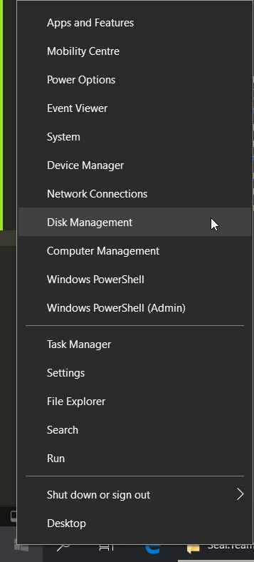

- You will see the unallocated space at a *Removable disk*. Usually it has a black headbar
- Right click on it, click *New Simple Volume* and just click *Next* until the end. Make sure the file system is FAT32, not NTFS!


# 2. Download OS image
- Raspbian is a Linux based OS specially made for the Raspberry Pi. It has several versions/generations, you should always go with the latest. As of writing this, the latest is *Buster*
- Go to the [Raspbian website](https://www.raspberrypi.org/downloads/raspbian/) and download the .zip file. I suggest to go with the full version, with desktop and all the recommended SW. 

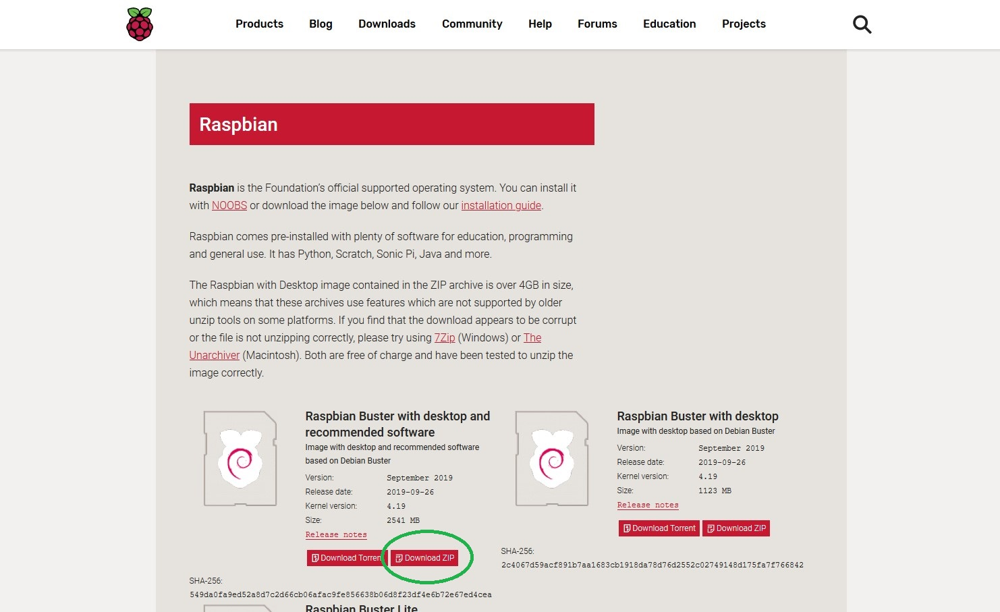

# 3. Download Etcher
- There are different ways to flash the OS on your SD card, this time we will do it using Etcher
- Go to the [Etcher website](https://www.balena.io/etcher/), download, install, and run it
- This shouldn't take more the a minute or two

# 4. Flash the SD card
- In Etcher click *Select image* and browse the .zip you just downloaded in step 2.
- Click *Select drive* and select your SD card
- Then click *Flash*

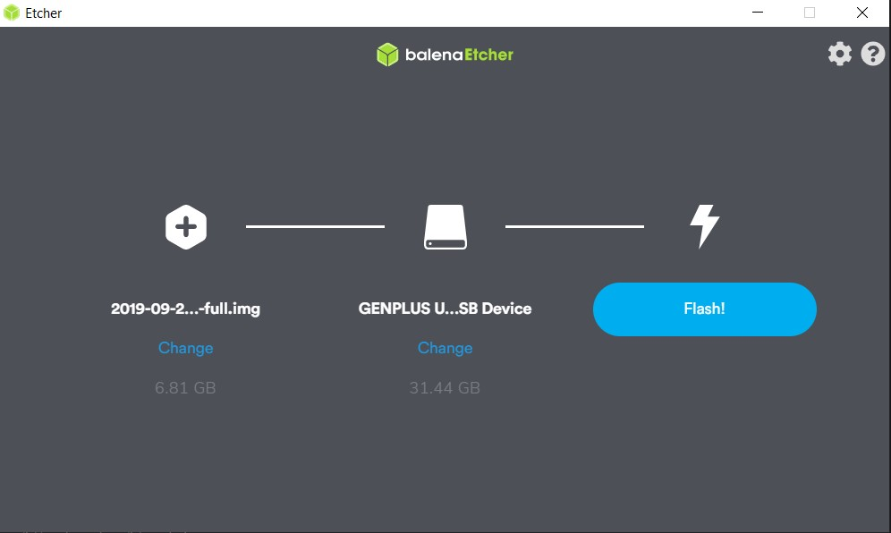

- This is going to take a long time if you choose the full version of Raspbian
- And the end you'll get a number of alerts prompting you to format the card. Close these windows or click *Cancel*. Do **NOT** format the card

# 5. Create necessary files for headless connection
- If you have a monitor, keyboard, mouse, and the proper cables, at this point you can just put the card in the Raspberry, plug everything in and fire it up. If you don't and want to access it from a different computer keep going with the tutorial
- Go to the *boot* drive on the card and create a new file. The name should be *ssh* with NO EXTENSION.

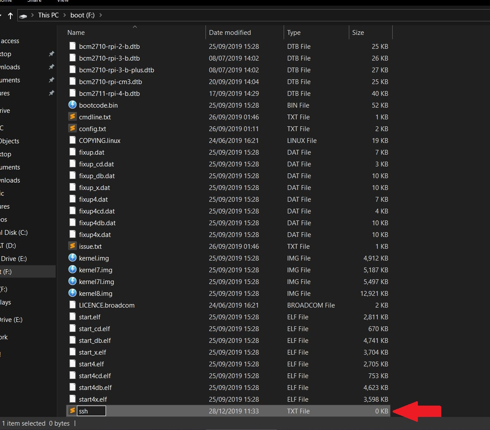

- You can connect to the Pi via your Wifi network or direct Etherner cable

## 5.a Via Wifi
- If you want to connect with your Pi to your Wifi (for any reason) go to *boot* drive on the card and create a file. The name and extension should be *wpa_supplicant.conf*

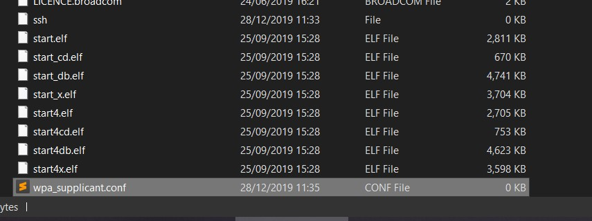

- Open it with Notepad++ or Sublime etc., and paste in the following:
```
ctrl_interface=DIR=/var/run/wpa_supplicant GROUP=netdev
update_config=1
country=<Insert country code here>

network={
 ssid="<Name of your WiFi>"
 psk="<Password for your WiFi>"
}
```
- Insert your coutry code, SSID(the name of your Wifi network) and password where it says (Delete the `<>` brackets too but leave the quotation marks)
- You can find your ISO alpha-2 country code [here](https://en.wikipedia.org/wiki/List_of_ISO_3166_country_codes)
- You can put log-in information about multiple Wifi network in this file (e.g. if you are using it at home, in your school, workplace etc.). Just add multiple `network = {}` sections
```
network={
    ssid="<SCHOOLS NETWORK NAME>"
    psk="<SCHOOLS PASSWORD>"
    id_str="school"
}

network={
    ssid="<HOME NETWORK NAME>"
    psk="<HOME PASSWORD>"
    id_str="home"
}
```
- More info about setting up Wifi this way [here](https://www.raspberrypi.org/documentation/configuration/wireless/wireless-cli.md)
- Put the card in the Pi and power it up
- Jump to step 6

## 5.b Via ethernet cable
- Connect your Pi and computer with an ethernet cable and power it up
- Right click on the Windows home button, click *Network Connections*

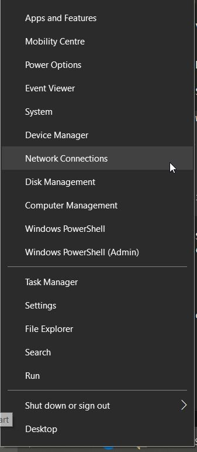

- Click *Change adaper options*

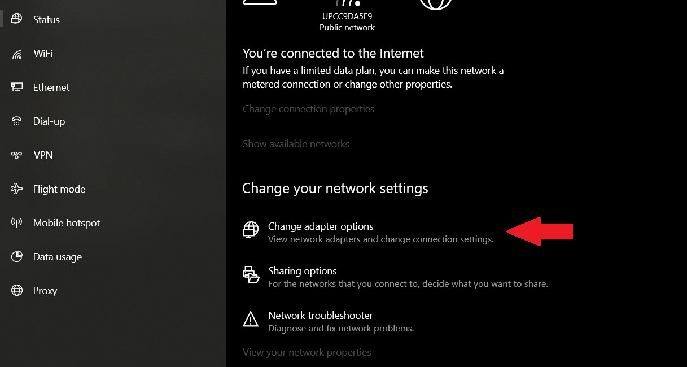

- You will see an unidentified ethern network
- Right click on it, click properties

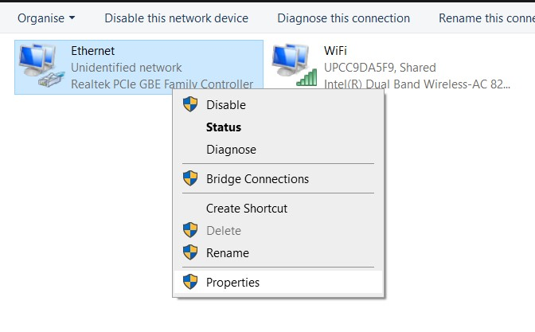

- Click on the TCP/IPv4 line once, then click *Properties*

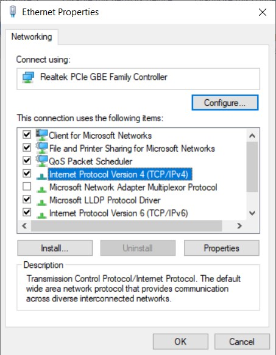

- Take note of the IP address there

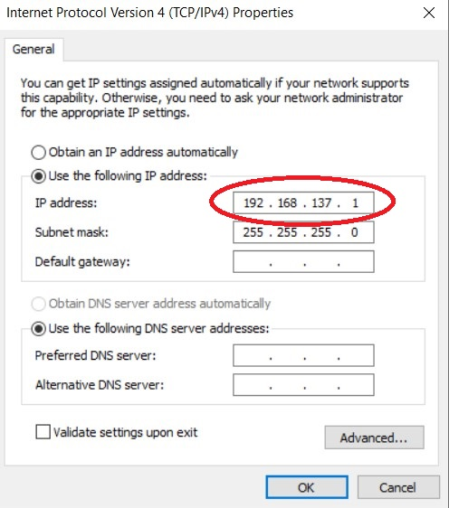

- Go back to the Network Settings
- Right click on your Wifi (or other live connection) and click properties
- Go to the *Sharing* tab
- Tick the "Allow other network users to connect through this..." box

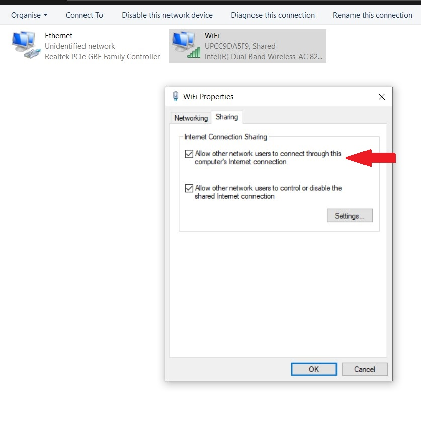

# 6. Download three more things
- You'll need to know the IP of the Pi to connect to it. There are other ways to find it out but the best course is to:
- Download the [Angry IP Scanner](https://angryip.org/download/#windows)
- You'll need the following to make a connection with your Pi and have a graphical interface:
- Download [PUTTy](https://www.chiark.greenend.org.uk/~sgtatham/putty/latest.html)
- Download [Xming](https://sourceforge.net/projects/xming/)

# 7. find the IP address
## 7.a If the Pi is connected to your Wifi
- Open up a command line on your computer: Press the Windows key, type *cmd*, press enter
- Type *ipconfig*
- Take note of your IP address. This is the local address of your PC

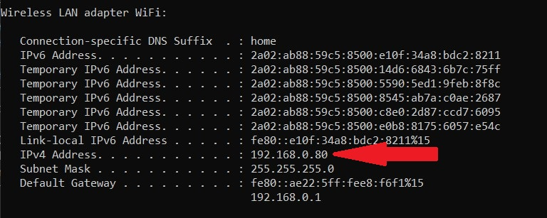

- Open Angry IP scanner
- The IP Range should be the same, only from 0 to 255

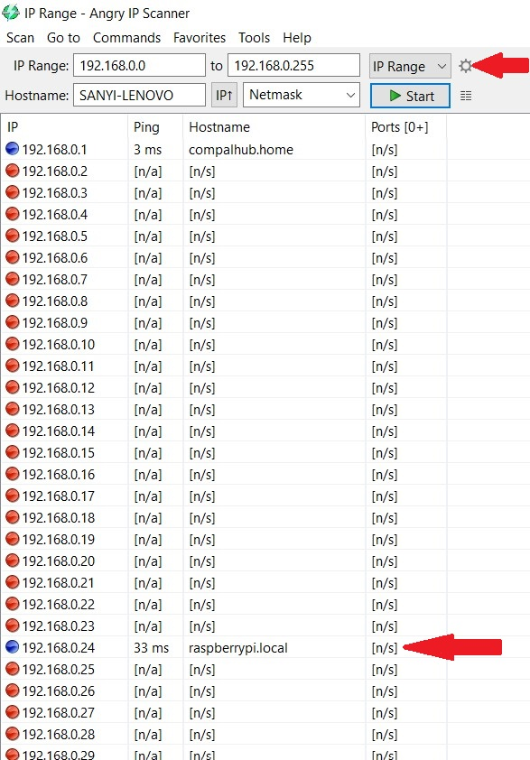

- Press start and look for the *raspberrypi.local* in the results. **NOTE**: After booting up it can take 1 or 2 minutes for the Pi to connect to the Wifi, so if at first you can find it, wait a bit and run it again
- Take note of this IP

## 7.b If you are connected via ethernet cable

- Open Angry IP scanner
- The IP Range should be the as the one you took note of in step 5.2, only from 0 to 255 (see step 7.1)
- Press start and look for the *raspberrypi.local* in the results

# 8. Connect to the Pi
- Open PuTTY
- On the starting page, type in the IP address
- Alternatively you can type in *raspberrypi.local*. This way you don't have to find the Pi's IP address (step 7) but it's guaranteed to work. I had times when even Angry IP scanner could find the Pi but if I put the IP in here (which I knew because of previous connections), I could easily connect.


- In the *Category*, on the left hand side, find Connections/SSH/X11
- Enable X11 forwarding
- In general X11 forwarding is used to run graphical applications on a server (normally servers should not have an X server or graphical applications running)

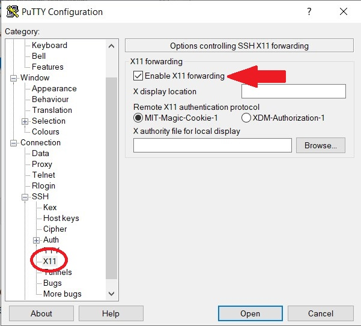

- In the next window that pops up, you will be prompted to log in
- The default login username is `pi` and the password is `raspberry`
- **NOTE:** the password will not be visible as you type it. Not even `*`s
- You should get something like this:

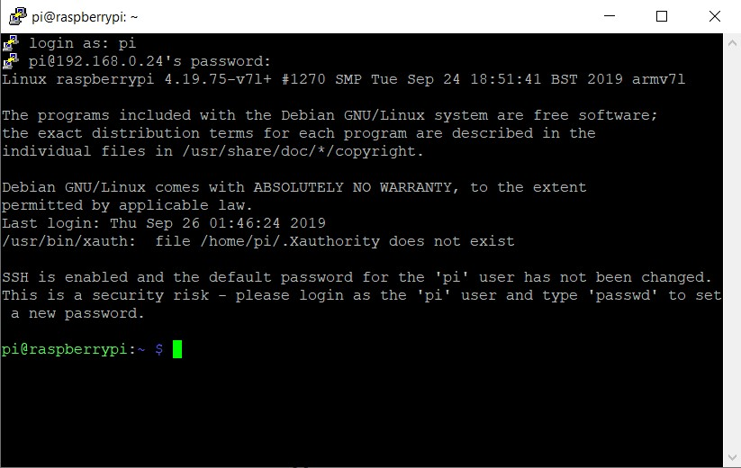

- At this point you can interact with your Pi through the command line interface
- If you want the graphical interface (desktop and browser and all) make sure Xming is running 
- It should appear on you taskbar

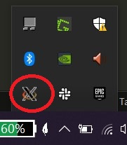

- Type `lxsession` in the command line, hit enter. In a couple of seconds the Pi's desktop should open up