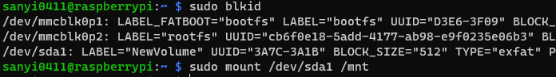

# Raspberry Pi Plex server

Last update: december 2023

### <u>Basic setup</u>
- Open a new terminal on the Pi or ssh into it
- Run `sudo apt-get update && sudo apt-get upgrade`
- Run `sudo apt-get install apt-transport-https`
- Run `curl https://downloads.plex.tv/plex-keys/PlexSign.key | gpg --dearmor | sudo tee /usr/share/keyrings/plex-archive-keyring.gpg >/dev/null`
- Run `echo deb [signed-by=/usr/share/keyrings/plex-archive-keyring.gpg] https://downloads.plex.tv/repo/deb public main | sudo tee /etc/apt/sources.list.d/plexmediaserver.list`
- Run `sudo apt-get update`
- Run `sudo apt install plexmediaserver`
- Now you can access Plex with any browser on `192.168.0.100:32400/web` (Replace the IP address as needed)
- Follow the setup guide on the first startup to name your server and add libraries

### <u>External drives</u>
- If you would like to use an external drive with your drive, it is recommended to format it to `exFAT`. If you want to use an `NTFS` formatted drive, you will need to take extra steps.
- If you are using an external drive with you Pi and it is mounted to `/media/yourusername` you won't be able to access it. You will need to mount the drive somewhere, where Plex has access to it, e.g. under `/mnt/`
    - Run `sudo blkid` and look for your external drive. 
    - Check were it is mounted. In the below example it is `/dev/sda1`
    - Run `sudo mount /dev/sda1 /mnt` to mount it under `/mnt`
    - If you want to use multiple external drives run `sudo mount /dev/sda1 /mnt/MyDrive1` instead.

