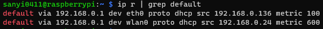
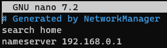
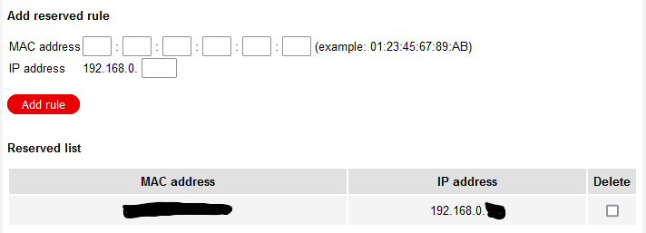

# Static IP for your Raspberry Pi

Last update: december 2023

<u>Option A</u>
- ssh into the Pi or open a new terminal on the Pi desktop
- Run `hostname -I`
    - This will return your current IP on the local network
    - Take note of this IP as we will use this to set as static IP
- Run `ip r | grep default`
    - This will return the IP address of your router. Take note of it.
    - Also take note of the network interface. It is usually `eth0` for wired ethernet and `wlan0` for wifi.



- Run `sudo nano /etc/resolv.conf`
    - The opened file contains the IP of your DNS server. It is usually the same as your router's. Take note of it. Or you can use an alternative DNS server like 8.8.8.8 (Google) or 1.1.1.1 (Cloudflare)
    - Close the file with `Ctrl+X`



- Run `sudo nano /etc/dhcpcd.conf`
- In the opened file, scroll to the bottom and add the following lines:
```
interface eth0
static ip_address=192.168.0.999
static routers=192.168.0.1
static domain_name_servers=192.168.0.1
```
- Replace the interface and the IP addresses as needed.
- You can add this section twice. Once for `eth0` and once for `wlan0`
- Reboot by running `sudo shutdown -r now`

<u>Option B</u>

- Open your router's settings
- Look for `DHCP settings`, probably under `Advanced settings`
- Look for `Reserved IP addresses` and add a reserve rule

