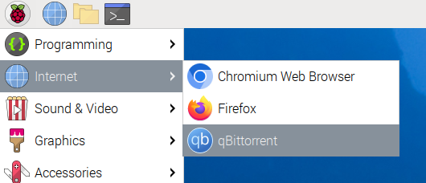
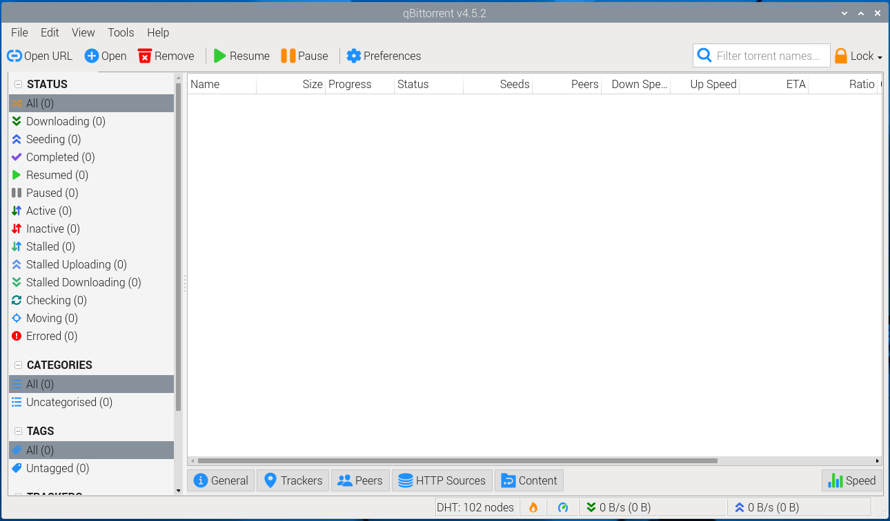
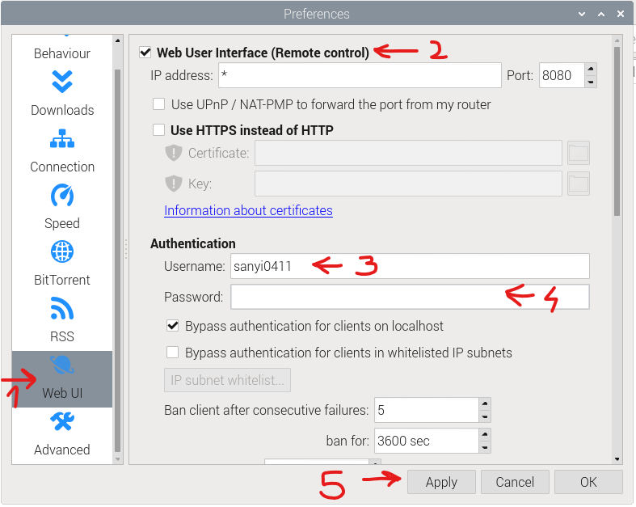
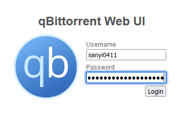

# qBittorrent on Raspberry Pi

### <u>Option A - Desktop version</u>
- You can use this version if you have access to the Pi's desktop and you can use a mouse and a keyboard with the Pi
- You cannot use this version if you only have a terminal
- Update the Pi:
```
sudo apt update && sudo apt upgrade
```
- Install the desktop version of qBittorrent:
```
sudo apt install qbittorrent
```
- On your Pi, click the "Start menu" (the raspberry icon) -> Internet -> qBittorrent



- On first start you will get a Legal notice popup. Click `I Agree`
- This will bring up the qBittorrent client. You are ready to use it



Enabling the Web UI
- qBittorrent has a Web UI so you can manage your torrent remotely, from a browser on another computer
- In qBittorrent click `Tools` -> `Preferences`
- In the newly opened window, on the left side click `Web UI`
- Check the `Web User Interface` mark
- Set a username and set a strong password
- Click `Apply`



- To acces the interface, on another computer open a browser and go to (replace the IP as needed, but keep the port number)
```
http://192.168.0.136:8080
```
- You will be greeted with a login window



- Now you are ready to use qBittorent on your Pi remotely

### <u>Option B - Headless version</u>
- You can use this version if you only have terminal access to the Pi
- Update the Pi:
```
sudo apt update && sudo apt upgrade
```
- Install the headless version of qBittorrent:
```
sudo apt install qbittorrent-nox
```
- With this version you will have to control qBittorrent client through the web interface
- We need to create a service to keep the running in the background
- For that, we need to create a new user
    - `-r` (`--system`): makes it a system user. This user cannot be logged in to.
    - `-m`: creates a home directory for the user
```
sudo useradd -r -m qbittorrent
```
- Get access to the files created by `qbittorrent`
    - `-a`: add a new attribute to the user
    - `-G`: add a group
```
sudo usermod -a -G qbittorrent pi
```
- Create a service. This will run under the user and group that we created.
```
sudo nano /etc/systemd/system/qbittorrent.service
```
- Add the following lines
    - `-d`: run it as daemon
    - `--webui-port`: make Web UI available on the specified port
```
[Unit]
Description=qBittorrent
After=network.target

[Service]
Type=forking
User=qbittorrent
Group=qbittorrent
UMask=002
ExecStart=/usr/bin/qbittorrent-nox -d --webui-port=8080
Restart=on-failure

[Install]
WantedBy=multi-user.target
```
- Save and close the file
- Make it start every time the Pi boots
```
sudo systemctl enable qbittorrent
```
- If you don't want to reboot now, you can start it manually
```
sudo systemctl start qbittorrent
```
- Check if it is really running
```
sudo systemctl status qbittorrent
```
- You should see an `Active: active (running)` line